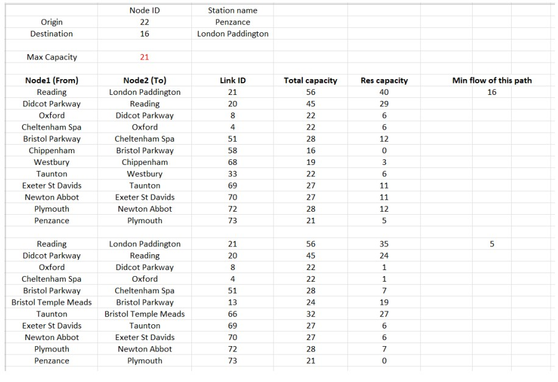

# Building a Decision Support System for GWR
Used Ford-Fulkerson Algorithm algorithms to solve a maximum flow problem. The maximum flow problem is a problem for determining the maximum amount of stuff that can flow at a given point in time through a single source flow network, subject to capacity constraints on the edges.

### Define the question
The goal in this project is to build a support system for The Great Western Railway to find out the max number of trains that could be sent from one origin station to another destination.   

### Structure of the worksheet

  

A user form is conducted and would call the function to complete the programme.

### Definition of parameters 
Link ID is the index number of each link. Node1 ID and Node2 ID are the station index recoded in number, it should refer to the first worksheet. Capacity is the amount of capacity of each link.

### Solution algorithm
An important concept to understand the algorithm is the residual graph.
This is a graph generated by calculating how the flow along each edge can
be modified, each edge in the network graph is replaced by up to two new
edges, a forward edge with the same direction that signifies how much the
flow can be increased, and a backward edge storing how much the flow can
be reduced. In other words, residual graph gives you a chance to walk back.
By iteratively finding augmenting path, meaning updating the new flow
network and checking the residual graph continuously, we could find the
maximum capacity.  

### Demonstration of trail of the origin-destination pairs
If we run the programme as origin- Penzance and destination- London
Paddington, we could have the output as following graph. The max capacity
from Penzance to London Paddington is 21. Two paths were found with 16
flow and 5 flow capable to be sent. The flow in the first path run through 12
nodes, the order would be Penzance as start point and moved to Plymouth,
then Newton Abbot and more 10 nodes to Reading, and finally arrive
London Paddington.  

 

 

We could also do it in reverse, take London Paddington as origin and
Penzance as destination. This time only one path is feasible carrying 19 flow,
being the maximum flow from origin to destination. 

 

An User Interface is designed and crafted to catch error cases.  

 

### Analysis and Conclusion 
1.  the capacity in the high dense population
areas should have more connected and have more capacity. As these big
cities tend to carry more passengers and are more likely to have large
gathering activities.
2.  Pay attention to the station of airport. When festival approaches,
the demand could be enormous. Gatwick Airport is the only airport in our
data, and there is only one node connects to it with capacity 30.
